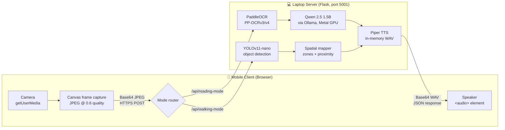

# VisionMate — Architecture

## 1. System Overview

VisionMate is a **local-first, two-device system**: a smartphone browser acts as a wireless camera and audio output, while a laptop runs the full AI pipeline. The two communicate exclusively over the local Wi-Fi network — no cloud services are involved at any point.



## 2. Component Pipeline

| Stage | Technology | Runs on | Role |
|---|---|---|---|
| Frame capture | Browser `getUserMedia` + `<canvas>` | Phone | Grabs a JPEG frame (quality 0.6) and Base64-encodes it |
| Transport | Flask 3 + HTTPS (self-signed) + CORS | LAN | Carries frames laptop-ward and audio phone-ward as JSON |
| Text extraction | PaddleOCR (PP-OCRv3 det + PP-OCRv4 rec + angle classifier) | Laptop CPU | Detects and recognizes printed text; lines below 0.75 confidence are discarded |
| Text correction | Qwen 2.5 1.5B on Ollama | Laptop GPU (Metal) | Fixes OCR character errors and stitches broken/hyphenated lines into flowing paragraphs |
| Obstacle detection | YOLOv11-nano (`ultralytics`) | Laptop CPU | Detects objects (80 COCO classes) with confidence ≥ 0.35 |
| Spatial reasoning | Pure Python (`modes/walking.py`) | Laptop CPU | Maps detections to left/ahead/right zones, estimates proximity, composes the alert sentence |
| Speech synthesis | Piper (en_US-lessac-medium, ONNX) | Laptop CPU | Generates a WAV entirely in memory (`BytesIO`) — nothing written to disk |
| Playback | `<audio>` element with Base64 `data:` URI | Phone | Speaks the result; its `onended` event triggers the next capture cycle |

## 3. Data Flow — Reading Mode

1. User taps **Start**; the browser captures a frame and POSTs `{image: "data:image/jpeg;base64,..."}` to `/api/reading-mode`.
2. Flask decodes the Base64 payload into an OpenCV BGR matrix (`np.frombuffer` → `cv2.imdecode`). The image exists **only in RAM**.
3. PaddleOCR extracts text lines; low-confidence lines (< 0.75) are dropped rather than spoken wrongly.
4. The raw text is embedded in a **strictly constrained prompt** and sent to Qwen 2.5 via the local Ollama API (`127.0.0.1:11434`). The prompt forbids summarizing, answering questions found in the text, or adding commentary — the model may only *correct and stitch*.
5. Piper synthesizes the corrected text to WAV bytes in memory.
6. The server responds `{text, audio_base64}`; the phone displays the text and plays the audio.
7. When playback ends, the client waits 1.5 s (a natural "breathing window") and captures the next frame.

## 4. Data Flow — Walking Mode

1. Same capture/transport as above, targeting `/api/walking-mode`.
2. YOLOv11-nano returns classes, confidences, and bounding boxes.
3. The spatial mapper:
   - splits the frame into **left / ahead / right** thirds by bounding-box center;
   - estimates proximity from the **bounding-box area ratio** — > 30 % of the frame = *immediate*, > 10 % = *close*, otherwise *far* (ignored);
   - classifies priority **safe-by-default inverted**: a small allow-list of harmless tabletop objects (cup, book, keyboard…) is low priority; *everything else is treated as a hazard*. Unknown ≠ safe.
4. The alert composer reports the single most urgent object per zone, left → center → right (e.g. *"clear left. chair close ahead. clear right."*). A high-priority object at *immediate* range prepends **"Stop."**; an empty scene yields *"Caution. Open space ahead"*.
5. Piper speaks the alert; the cycle repeats continuously while walking.

## 5. Local vs. Cloud Components

| Component | Location |
|---|---|
| OCR, LLM, object detection, TTS, spatial logic | **100 % on-device (laptop)** |
| Phone ↔ laptop transport | Local Wi-Fi only (HTTPS on `192.168.x.x`) |
| Cloud services | **None** |
| Internet required | Only once, for initial model downloads |

## 6. Key Design Decisions

1. **Phone browser as sensor, not a native app.** Zero installation, works on any phone (iOS/Android), and keeps all compute on the laptop where the models live. The trade-off — browser security policies (HTTPS-only camera, tap-gated audio) — is handled with a self-signed certificate and an audio-unlock on the Start tap.
2. **Local-first everything.** What a person reads and where they walk is among the most intimate data imaginable. Processing locally makes privacy a *property of the architecture*, not a policy promise.
3. **A small LLM as an OCR "repair shop", not an oracle.** Qwen 2.5 1.5B is deliberately small (runs in ~1.2 GB, fully GPU-resident on Apple Silicon) and deliberately constrained by prompt: it corrects and stitches text but must not answer questions or summarize — which also acts as a prompt-injection shield against malicious text in scanned documents.
4. **In-memory audio (Base64 WAV).** Earlier versions wrote WAV files to disk and served them via a second request. v5 synthesizes into `BytesIO` and inlines the audio in the JSON response: one round-trip, no disk artifacts, no cleanup, no stale-file privacy leak.
5. **Safe-by-default hazard logic.** In walking mode, an object class *not* on the explicit "harmless" list is automatically a hazard. A misclassification therefore fails toward caution, never toward silence.
6. **Reactive cadence instead of a fixed frame rate.** The next frame is captured only after the previous audio finishes plus a 1.5 s pause. The user is never talked over, and the pipeline never queues up stale frames.
7. **Nano/mobile model variants throughout** (YOLO-nano, PaddleOCR mobile, Piper medium, 1.5B LLM) so the entire stack fits comfortably in 16 GB of shared memory alongside the OS.
8. **Port 5001, not 5000** — macOS AirPlay Receiver occupies port 5000 on modern Macs.

## 7. Deployment Topology

```
┌─────────────────────────────┐        Wi-Fi LAN         ┌──────────────────────────────┐
│ Any phone (Android / iOS)   │  ─────────────────────▶  │ Any laptop/PC                │
│ or any browser device       │   HTTPS :5001 (JSON)     │ (Windows / Linux / macOS)    │
│ camera + speaker            │  ◀─────────────────────  │ Flask + PaddleOCR + YOLO     │
└─────────────────────────────┘                          │ + Piper (CPU)                │
                                                         │ Ollama + Qwen 2.5 (GPU/CPU)  │
                                                         └──────────────────────────────┘
```

Both sides are interchangeable commodity hardware: the client is any device with a browser, camera, and speaker; the server is any computer that runs Python (reference test rig: MacBook M5 — see the Technical Report).
